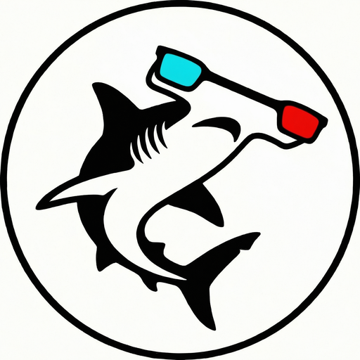

# Sphyrnidae

<div align="center">
  
</div>

A web application for viewing and editing stereoscopic images.

## Table of Contents

- [About](#about)
- [Features](#features)
- [Why Sphyrnidae?](#why-sphyrnidae)
- [Getting Started](#getting-started)
- [Usage](#usage)
- [Development Verification](#development-verification)
- [License](#license)
- [Authors](#authors)
- [Acknowledgments](#acknowledgments)

## About

Sphyrnidae is an open-source web application for viewing stereoscopic images with various display methods. It works directly in your web browser.

## Features

- **Multiple Viewing Modes**: Anaglyph, interlace, side-by-side, and more
- **In-Browser Processing**: All processing happens directly in your web browser—no file uploads required. Your images stay private and never leave your device
- **Image Alignment & Parallax Adjustment**: Align left and right images and adjust parallax to fine-tune the 3D viewing experience
- **Image Quality Adjustment**: Simple adjustments for brightness, contrast, and other image properties
- **Viewer Mode**: Browse through multiple images with navigation controls
- **URL List Loading**: Load entire collections from text files via URL parameter
- **Clipboard Export**: Share images with settings via clipboard in multiple formats

## Why Sphyrnidae?

The name "Sphyrnidae" refers to the family of [hammerhead sharks](https://en.wikipedia.org/wiki/Hammerhead_shark), creatures with a fascinating biological feature: their distinctive head shape enables exceptional stereoscopic vision.

Research has shown that hammerhead sharks utilize their wide, flattened head structure to achieve enhanced binocular overlap—the area where both eyes can see the same object simultaneously. According to [McComb et al. (2009)](https://journals.biologists.com/jeb/article/212/24/4010/9615/Enhanced-visual-fields-in-hammerhead-sharks) in the *Journal of Experimental Biology*, winghead sharks possess binocular overlap of approximately 48 degrees, nearly four times larger than that of other shark species. This anatomical adaptation allows hammerheads to perceive depth with remarkable precision, giving them a significant hunting advantage in murky ocean environments.

Interestingly, in Japanese, these sharks are called シュモクザメ (*shumokuzame*), a name that reflects a clever analogy: while "hammer" describes the shape, the Japanese term draws from 撞木 (*[shumoku](https://en.wiktionary.org/wiki/%E6%92%9E%E6%9C%A8)*), a wooden mallet used to strike Buddhist temple bells.


We drew inspiration from this natural 3D vision system: just as hammerhead sharks use their unique morphology to see the world in stereo, Sphyrnidae lets you view stereoscopic images with the visual clarity that nature itself has perfected.

## Getting Started

The easiest way to use Sphyrnidae is to visit the web application at:

https://sphyrnidae.pages.dev/

## Usage

There are four ways to load and display local images:

1. **Stereo image**: Select a single stereo image (auto format detection).
2. **Manual selection**: Select an image, then specify the display format manually.
3. **Left/right images**: Choose separate left and right image files.
4. **Viewer mode**: Load multiple files or a folder and browse them as a list.

### Direct URL Loading

You can load images directly by passing their URL as a query parameter:

```
https://sphyrnidae.pages.dev/?src=https://example.com/image.jpg&mode=anaglyph
```

With format, shift, alignment, and crop values:
```
https://sphyrnidae.pages.dev/?src=https://example.com/image.jpg&format=full_sbs&x=10&y=-5&r=2.5&z=1.8&crop=0.12,0.08,-0.03,0.01
```

**Query Parameters:**
- `src` (required): URL of the stereoscopic image to load
- `mode` (optional): Display mode name (see list below, defaults to `anaglyph` if not specified)
- `format` (optional): Image format — skips auto-detection when specified. Values: `full_sbs`, `half_sbs`, `full_tab`, `half_tab`, `interlace_h`, `interlace_v`
- `x` (optional): Parallax shift in pixels (e.g., `x=10`, `x=-5.5`)
- `y` (optional): Vertical shift in pixels (e.g., `y=3`, `y=-2`)
- `r` (optional): Alignment rotation (roll) in degrees (e.g., `r=2.5`, `r=-1.2`). Together with `z`, reproduces the depth-preserving vertical-affine alignment produced by geometric refinement.
- `z` (optional): Alignment vertical-zoom in percent (e.g., `z=1.8`, `z=-0.5`)
- `crop` (optional): Crop window as four comma-separated normalized values `cropX,cropY,offsetX,offsetY` (e.g., `crop=0.12,0.08,-0.03,0.01`). `cropX`/`cropY` are the horizontal/vertical trim ratios; `offsetX`/`offsetY` pan the crop window. Resolution-independent.

**CORS Requirement:**
When loading images from external URLs, the server hosting the image must have CORS (Cross-Origin Resource Sharing) enabled. If you encounter a CORS error, ensure the server sends appropriate `Access-Control-Allow-Origin` headers, or host the image on the same domain as the application.

**Offline and privacy behavior:**
External images and URL-list files are fetched from the network when requested. The Service Worker deliberately does not store arbitrary third-party URLs in its Cache Storage, so the app does not provide offline reuse for them. This avoids retaining private images or signed URL query parameters on the device in the app cache. As with any direct URL request, the image host receives the request from your browser.

### URL List Loading

Load multiple images at once using a text file URL:

```
https://sphyrnidae.pages.dev/?list=https://example.com/urls.txt
```

The text file should contain one URL per line, with optional settings:

```txt
# Simple format (one URL per line)
https://example.com/image1.jpg

# With settings (key=value format)
https://example.com/image2.jpg format=half_sbs mode=parallel x=10 y=-5 r=2.5 z=1.8 crop=0.12,0.08,-0.03,0.01

# Comments are supported
# This is a comment line
https://example.com/image3.jpg format=full_tab
```

**Query Parameters:**
- `list` (required): URL of the text file containing the URL list
- Takes precedence over `src` parameter if both are present

**URL List Format:**
Each line can contain:
- URL only: `https://example.com/image.jpg`
- URL with options: `https://example.com/image.jpg format=half_sbs mode=parallel x=10 y=-5 r=2.5 z=1.8 crop=0.12,0.08,-0.03,0.01`
- Relative path: `image.jpg` or `sub/image.jpg` — resolved against the list file's own URL, so a list can reference images placed alongside it
- Comments: Lines starting with `#` are ignored
- Empty lines are ignored

**Available Options (all optional):**
- `format`: Image format (same values as query parameter)
- `mode`: Display mode name (e.g., `anaglyph`, `parallel`, `cross`)
- `x`: Parallax shift in pixels
- `y`: Vertical shift in pixels
- `r`: Alignment rotation (roll) in degrees
- `z`: Alignment vertical-zoom in percent
- `crop`: Crop window `cropX,cropY,offsetX,offsetY` (normalized, comma-separated)

**Note:** Even single-URL lists automatically start in viewer mode for consistent navigation experience.

### Clipboard Export

When viewing images loaded from URL, you can export the current image settings to clipboard in two formats:

**List Format** (for URL lists):
```
https://example.com/image.jpg format=half_sbs mode=parallel x=10 y=-5 r=2.5 z=1.8 crop=0.12,0.08,-0.03,0.01
```
- Compact format suitable for building URL lists
- `format` is always included; other keys are emitted only when non-default (`mode`, `x`, `y`), with `r`/`z` appearing only when geometric-refinement alignment is active and `crop` only when a crop is applied
- Can be pasted into text files and loaded via `?list` parameter

**Viewer Format** (direct link):
```
https://sphyrnidae.pages.dev?src=https://example.com/image.jpg&mode=parallel&format=half_sbs&x=10&y=-5&r=2.5&z=1.8&crop=0.12,0.08,-0.03,0.01
```
- Complete URL ready to share
- Opens directly in browser
- All settings preserved in URL

### Embedding with sphyrnidae-link

Use the `sphyrnidae-link` custom element to create clickable image links that open in Sphyrnidae:

1. Include the script in your HTML:
   ```html
   <script src="https://sphyrnidae.pages.dev/sphyrnidae-link.js"></script>
   ```

2. Add `<sphyrnidae-link>` tags to your page:
   ```html
   <sphyrnidae-link src="path/to/image.jpg" alt="Example stereo image" mode="anaglyph"></sphyrnidae-link>
   ```

**sphyrnidae-link Attributes:**
- `src` (required): URL of the image (relative or absolute)
- `alt` (optional): Alternative text for the thumbnail
- `mode` (optional): Display mode when the link is clicked
- `format` (optional): Image format (`full_sbs`, `half_sbs`, `full_tab`, `half_tab`, `interlace_h`, `interlace_v`)
- `x` (optional): Parallax shift in pixels
- `y` (optional): Vertical shift in pixels
- `r` (optional): Alignment rotation (roll) in degrees
- `z` (optional): Alignment vertical-zoom in percent
- `crop` (optional): Crop window `cropX,cropY,offsetX,offsetY` (normalized, comma-separated)
- `viewer-url` (optional): Custom viewer URL (defaults to index.html in the same directory)
- `width` (optional): Thumbnail width (e.g., "200px", "100%")
- `height` (optional): Thumbnail height (e.g., "150px")
- `target` (optional): Link target (default: "_blank")

**Example:**
```html
<sphyrnidae-link
  src="stereo-photos/landscape.jpg"
  alt="Mountain landscape"
  mode="parallel"
  format="full_sbs"
  x="10"
  y="-5"
  r="2.5"
  z="1.8"
  crop="0.12,0.08,-0.03,0.01"
  width="300px"
  height="200px">
</sphyrnidae-link>
```

### Display Modes

The following viewing modes are supported via the `mode` parameter (use the mode name as shown below):

- `anaglyph` / `anaglyph_color`: Anaglyph (color)
- `anaglyph_gray`: Anaglyph (grayscale)
- `anaglyph_blue_yellow`: Anaglyph (blue/yellow)
- `anaglyph_dubois`: Anaglyph (Dubois method)
- `interlace_h`: Horizontal interlace
- `interlace_v`: Vertical interlace
- `half_sbs`: Half side-by-side
- `parallel`: Parallel viewing
- `cross`: Cross-eyed viewing
- `tab`: Half top-and-bottom (compressed vertically)
- `full_tab`: Full top-and-bottom (uncompressed)
- `wiggle`: Wiggle stereoscopy
- `lrl`: LRL format
- `matrix_2x2`: 2x2 matrix

## Development Verification

The committed regression tests are framework-free and require a current Node.js runtime:

```sh
node --test tests/alignment-geometry.test.mjs tests/pixel-utils.test.mjs tests/histogram.test.mjs
```

The release workflow additionally performs JavaScript syntax checks, validates
the Service Worker precache manifest, and verifies the import-map CSP hash after
minification. Run the regression tests after changes to image geometry, crop,
alignment, histogram, or pixel-format validation.

## License

This project is licensed under the MIT License - see the [LICENSE](LICENSE) file for details.

This project also bundles or loads third-party open-source libraries, each under
its own license (MIT, Apache-2.0, and MPL-2.0). See
[THIRD-PARTY-NOTICES.md](THIRD-PARTY-NOTICES.md) for the full attributions and
license texts.

## Authors

- **Yosuke Yamazaki** - Main Development
- **Yoshifumi Takatsume** - Technical Collaboration

## Acknowledgments

This project was made possible with support from JSPS KAKENHI Grant Number JP25K15395 and JP24K06290.
